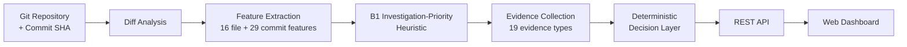
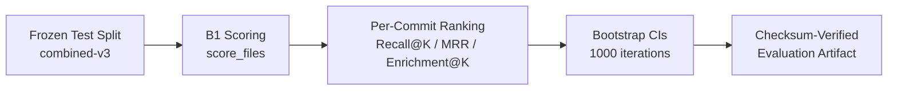

# AI Code Change-Risk Analyzer

## Overview

A system that analyzes Git commits to rank changed files by **investigation priority** and provide **evidence-backed context** for that ranking. Designed for large commits where manually inspecting every changed file is expensive.

## What the System Actually Does

The system answers two questions:

1. **Which files should I investigate first?** — The B1 investigation-priority heuristic ranks files within a commit by change magnitude.
2. **What evidence exists for each file?** — A 19-type evidence engine collects observable facts with provenance tracking.

The system does **not**:

- Predict that a file contains a defect
- Produce calibrated defect probabilities
- Classify files as defective or non-defective
- Claim causal explanations for defects

**B1** is an investigation-priority heuristic. Its score is a rank-normalized signal in [0, 1] indicating where a file falls in the investigation ordering — not a probability, not a risk score, not a severity rating.

## Architecture

### Online / Runtime Analysis

The production path processes a single commit through ingestion, scoring, evidence collection, and presentation:



### Offline Population Evaluation

Evaluation runs separately against a frozen test split. It is **not** part of the runtime request path:



## How It Works

### 1. Diff Analysis

`DiffAnalyzer` clones the repository (or opens a local clone), runs `git diff` against the target commit, and parses the unified diff into structured `CommitInfo` with per-file `FileDiff` objects containing line counts, hunk information, and binary status.

**Source**: `backend/app/analyzers/diff_analyzer.py`

### 2. Feature Extraction

`FeatureExtractor` computes 45 deterministic features from the commit:

- **16 per-file features**: language, binary status, test status, lines added/deleted/total, hunk count, function/class declaration changes, import changes, indentation statistics, hunk size
- **29 per-commit features**: aggregate change statistics, file status distribution, test/prod coupling, change entropy, language diversity

**Source**: `backend/app/features/schemas.py` (`FILE_FEATURE_NAMES`, `COMMIT_FEATURE_NAMES`)

### 3. B1 Investigation-Priority Scoring

`score_files()` applies the B1 change-size heuristic:

1. Binary files are separated and receive score 0.0
2. Non-binary files are sorted by `total_lines_changed` descending
3. Scores are rank-normalized to [0, 1] via `1.0 - rank / max_rank`

**B1 uses only two inputs**: `total_lines_changed` and `is_binary`. The full 45-feature representation is computed upstream but the current production strategy operates on change magnitude alone.

**Source**: `backend/app/inference/scoring.py`, `backend/app/inference/registry.py`

### 4. Evidence Collection

`EvidenceEngine` collects observable facts for each file across two tiers:

- **Cheap evidence** (no I/O, 15 types): lines changed, hunk count, function/class/import churn, file status, binary detection, indentation, hunk size, test file detection, test coupling, change concentration, language, B1 ranking
- **Historical evidence** (git subprocess, 4 types): recent commits, bug-fix patterns, days since last change, history availability

Each evidence item carries provenance tracking: `source` (diff, feature_extraction, git_log, path_convention, b1_ranking) and `provenance` (direct or derived).

**Source**: `backend/app/evidence/collector.py`

### 5. Deterministic Decision/Presentation

`DecisionEngine` transforms the investigation result into a structured presentation:

- **Priority bands**: Files are grouped into HIGHEST / HIGH / MEDIUM / LOW based on B1 output position (not risk categories)
- **Evidence projection**: Evidence items are projected verbatim into the response
- **Deterministic explanations**: Composed from evidence-type presence checks and structured fields — no LLM, no text parsing
- **Evidence gaps**: Detected for binary files, root commits, and unavailable history

`DecisionResult` is the deterministic structured contract. Runtime metadata (`analyzed_at`, `elapsed_ms`) lives in the `DecisionResponse` envelope and is not part of the deterministic output.

**Source**: `backend/app/decision/engine.py`, `backend/app/decision/schemas.py`

## API

Six REST endpoints:

| Method | Endpoint | Purpose |
|--------|----------|---------|
| GET | `/health` | Health check |
| POST | `/analysis/commit` | Diff analysis for a single commit |
| POST | `/analysis/pull-request` | Diff analysis for a branch comparison |
| POST | `/analysis/risk` | B1 investigation-priority ranking |
| POST | `/analysis/investigate` | B1 ranking with evidence collection |
| POST | `/analysis/decision` | Full deterministic presentation with priority bands |

Interactive documentation is available at `/docs` (Swagger UI) when the server is running.

Full API reference: [`docs/API.md`](docs/API.md)

## Example

> **Illustrative abbreviated response** from `POST /analysis/decision`:

```json
{
  "decision": {
    "repo_url": "https://github.com/example/repo",
    "commit_sha": "da39a3ee5e6b4b0d3255bfef95601890afd80709",
    "short_sha": "da39a3ee",
    "strategy": "B1_CHANGE_SIZE",
    "summary": {
      "total_files": 4,
      "files_ranked": 3,
      "files_binary": 1,
      "highest_count": 1,
      "high_count": 1,
      "medium_count": 1,
      "low_count": 1,
      "evidence_available": 3,
      "evidence_unavailable": 1
    },
    "files": [
      {
        "path": "src/main.py",
        "priority_band": "highest",
        "b1_score": 1.0,
        "b1_position": 0,
        "total_lines_changed": 120,
        "is_binary": false,
        "is_test_file": false,
        "evidence_count": 7,
        "explanation": "Highest-priority file with 120 line(s) changed; ..."
      }
    ],
    "limitations": [
      "Priority bands are rank-position groupings, not risk categories.",
      "B1 scores are investigation-priority ranking signals, not probabilities."
    ]
  },
  "analyzed_at": "2026-09-22T12:00:00+00:00",
  "elapsed_ms": 285.3
}
```

## Evaluation

### Current Production Evaluation (Phase 7)

The evaluation infrastructure operates against a frozen test split and computes commit-level ranking metrics:

- **Frozen dataset**: `combined-v3` test split (10,574 rows)
- **Scoring**: Frozen `score_files()` (B1) — no model retraining
- **Primary metrics**: Recall@K (K=1,2,3,5,10,20,50,100), Enrichment@K, MRR, rank of first positive
- **Confidence intervals**: 1000-iteration seeded bootstrap with commit-level resampling
- **Per-repository breakdown**: Metrics computed per repository
- **Artifact integrity**: SHA-256 checksum on saved evaluation results

Evaluation results are not committed to the repository. They can be reproduced by running `run_evaluation()` from `backend/app/evaluation/metrics.py` against the frozen test split.

**Source**: `backend/app/evaluation/metrics.py`, `backend/app/evaluation/population.py`, `backend/app/ml/phase413_evaluation.py`

### Historical ML Research (Phase 4.x)

Phases 4.6 through 4.13 conducted ML research that was **not promoted to the production strategy**:

- **XGBoost experiments** (Phase 4.6): Tested on repo-level round-robin split. ROC-AUC ~0.54–0.60 (near random). Per-commit ranking showed trivially perfect metrics because all positive commits had all files positive — a dataset characteristic, not model performance.
- **Supervision analysis** (Phases 4.7–4.12): Investigated 9 supervision strategies. Found 0 defensible negatives across all approaches. Concluded that no scientifically defensible file-level risk model is achievable with the current dataset.
- **Multi-signal ranking** (Phase 5.3): Tested function-churn, import-churn, and change-scattering signals combined with B1. Results not promoted to production.

**These are historical research findings.** The production system uses B1, not XGBoost.

**Source**: `backend/data/models/v0.1.0-combined-v3-phase4.6/evaluation_report.md`, `backend/data/models/v0.1.0-combined-v3-phase4.12/phase412_supervision_strategy.md`

### Dataset

| Characteristic | Value |
|----------------|-------|
| Supervised rows | 54,389 |
| Repositories | 50 |
| Observed positive rate | ~2% |
| Historical positive commits (defect_label=1) | 210 |
| FILE_STRONG commits | 125 |
| Defensible negatives | 0 |

The absence of defensible negatives is a fundamental limitation. No file can be confidently labeled "not defective," which constrains what any ML-based approach can achieve.

**Source**: `backend/data/models/v0.1.0-combined-v3-phase4.12/phase412_supervision_strategy.md`

## Engineering Decisions

### 1. B1 is a heuristic, not a probability

With 0 defensible negatives in the dataset, no calibrated probability can be constructed. B1 uses rank-normalization, which requires no training and no negative labels. The score indicates investigation ordering, not defect likelihood.

**Source**: Phase 4.12 supervision strategy, `backend/app/inference/registry.py`

### 2. Evidence collection is separated from ranking

B1 scoring is a frozen, independent function. Evidence collection is a separate concern that can be extended without modifying the scoring contract. This allows the evidence engine to evolve while the ranking remains stable.

**Source**: `EvidenceEngine` is independent of `score_files()`

### 3. Deterministic presentation precedes any future LLM

Phase 8 produces structured, deterministic output before any LLM layer is introduced. This ensures reproducibility, traceability, and a stable contract for downstream consumers. An LLM would consume the structured `DecisionResult`, not replace it.

**Source**: `DecisionResult` docstring: "All semantic fields are deterministic given identical InvestigationResult input."

### 4. Historical semantics were aligned with frozen Git CLI

GitPython and the frozen `extract_historical_features()` produced semantically divergent results for 11/100 test cases. The fix aligned `committed_date` with `authored_date` and corrected message parsing to match the frozen Git CLI implementation.

**Source**: Commit `1430781`, `backend/tests/test_semantic_equivalence.py`

### 5. Evaluation is commit-level because of available labels

The dataset provides commit-level positive labels. File-level attribution was investigated in Phases 4.7–4.11b and found infeasible — 0 defensible negatives, weak path-overlap evidence only.

**Source**: Phases 4.7–4.12 reports

### 6. Evaluation artifacts are gitignored and reproducible

Evaluation results are generated from the frozen test split and frozen B1 scorer. Committing large JSON artifacts would bloat the repository. Results can be reproduced by running the evaluation pipeline.

**Source**: `.gitignore` excludes `backend/data/evaluation/`

### 7. Runtime metadata is separated from deterministic output

`DecisionResult` contains only deterministic semantic content. `analyzed_at` and `elapsed_ms` live in the `DecisionResponse` envelope. This ensures downstream consumers receive a stable, reproducible input.

**Source**: `backend/app/decision/schemas.py`

### 8. The feature pipeline computes more than B1 uses

The full 45-feature representation is extracted upstream, but B1 currently uses only `total_lines_changed` and `is_binary`. The broader feature set supports future strategies without modifying the extraction pipeline.

**Source**: `backend/app/inference/scoring.py`, `backend/app/inference/registry.py` (`feature_modes=("E0",)`)

## Limitations

1. **B1 is an investigation-priority heuristic**, not a calibrated probability. It rank-normalizes `total_lines_changed`. It does not predict whether a file contains a defect.

2. **Score semantics are limited.** The B1 score indicates relative position in the investigation ordering. It does not measure risk, severity, or defect likelihood.

3. **Evidence availability varies.** Historical evidence requires git subprocess access. Shallow clones may lack history. Binary files have limited evidence.

4. **Historical evidence has a bounded window.** The last 5 commits touching each file are examined. Older history is not considered.

5. **Binary files are excluded from B1 ranking.** They receive score 0.0 and are placed in the LOW priority band.

6. **The dataset has 0 defensible negatives.** No file can be confidently labeled "not defective." This fundamentally limits any ML-based approach.

7. **No LLM is currently used for explanations.** Explanations are deterministic templates grounded in evidence types. They are factually grounded but not natural-language fluent.

8. **Evaluation metrics may be non-discriminative.** The test set characteristic that all positive commits have all files positive makes ranking trivially perfect. The evaluation infrastructure is in place but the dataset limits its informativeness.

9. **Single-commit analysis.** The system analyzes one commit at a time. It does not consider PR context, review history, or multi-commit trends.

## Setup

### Requirements

- Python >= 3.12

### Installation

```bash
git clone <repository-url>
cd ai-risk-analyzer
pip install -e ".[dev]"
```

### Environment Variables (optional)

```bash
cp .env.example .env
```

Edit `.env` to set `GITHUB_TOKEN` for private repositories or higher API rate limits.

### Running the Server

```bash
uvicorn backend.app.api.main:app --reload
```

- **Swagger UI**: http://localhost:8000/docs
- **Dashboard**: http://localhost:8000/

## Testing

```bash
# Run all tests
pytest backend/tests/

# Run lint
ruff check backend/
```

Phase-specific test files:

```bash
pytest backend/tests/test_phase51_api.py          # Phase 5.1 API
pytest backend/tests/test_phase6_evidence.py       # Phase 6 evidence
pytest backend/tests/test_phase6_investigation.py  # Phase 6 investigation
pytest backend/tests/test_phase7_evaluation.py     # Phase 7 evaluation
pytest backend/tests/test_phase8_decision.py       # Phase 8 decision
```

## Project Structure

```
ai-risk-analyzer/
├── backend/
│   ├── app/
│   │   ├── analyzers/       # Git diff analysis
│   │   ├── api/             # FastAPI endpoints
│   │   ├── dataset/         # Dataset generation & validation
│   │   ├── decision/        # Deterministic presentation layer
│   │   ├── evaluation/      # Population-level evaluation
│   │   ├── evidence/        # Evidence collection engine
│   │   ├── features/        # Feature extraction (45 features)
│   │   ├── inference/       # Production inference (B1 scoring)
│   │   ├── investigation/   # Evidence-backed investigation
│   │   ├── ml/              # ML training & evaluation research
│   │   ├── schemas/         # Core domain models
│   │   └── services/        # Git service, diff parser
│   ├── data/
│   │   ├── datasets/        # combined-v3 (gitignored)
│   │   ├── models/          # Phase reports & artifacts
│   │   └── repos/           # Cloned repos (gitignored)
│   ├── scripts/             # Data generation scripts
│   └── tests/               # Automated test suite
├── frontend/                # Static HTML/CSS/JS dashboard
├── docs/                    # Architecture & API documentation
├── quantum/                 # Placeholder (empty)
├── infra/                   # Placeholder (empty)
└── pyproject.toml           # Project metadata & dependencies
```

## Roadmap

| Phase | Status | Description |
|-------|--------|-------------|
| Phase 1 | Completed | Git diff ingestion |
| Phase 2 | Completed | Feature extraction |
| Phase 3 | Completed | Dataset generation |
| Phase 4 | Completed | ML research (not promoted to production) |
| Phase 5.0 | Completed | Production inference layer |
| Phase 5.1 | Completed | REST API |
| Phase 5.2 | Completed | Web dashboard |
| Phase 5.3 | Completed | Experimental multi-signal ranking (not promoted) |
| Phase 6 | Completed | Evidence-backed investigation |
| Phase 7 | Completed | Population evaluation |
| Phase 8.0 | Completed | Deterministic presentation layer |

The `quantum/` and `infra/` directories are empty placeholders. All quantum/Braket references in the codebase state that such work is blocked pending a defensible problem formulation.

## License

See repository for license details.
