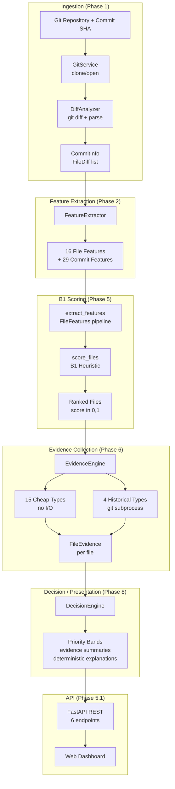

# Architecture — Current System (Phases 1–8)

## Overview

The AI Code Change-Risk Analyzer analyzes Git commits through a multi-layered pipeline: ingestion, feature extraction, investigation-priority scoring, evidence collection, and deterministic presentation. The system is designed with clear separation between runtime analysis and offline evaluation.

## Online / Runtime Analysis



## Offline Population Evaluation

Evaluation operates against a frozen test split and is **not** part of the runtime request path:

```mermaid
graph LR
    A[frozen test.jsonl<br/>10,574 rows] --> B[construct_file_features<br/>DatasetRow to FileFeatures]
    B --> C[score_files<br/>frozen B1]
    C --> D[rank_files_within_commit<br/>Recall@K, MRR, Enrichment@K]
    D --> E[_bootstrap_aggregate<br/>1000 iterations]
    E --> F[EvaluationResult<br/>SHA-256 checksummed]
```

**Source**: `backend/app/evaluation/metrics.py`, `backend/app/evaluation/population.py`

## Module Responsibilities

### Ingestion (Phase 1)

| Module | Responsibility |
|---|---|
| `backend/app/schemas/diff.py` | Domain models: `FileDiff`, `CommitInfo`, `DiffStats`, `Hunk`, `FileStatus` |
| `backend/app/services/diff_parser.py` | Regex-based unified diff parser |
| `backend/app/services/git_service.py` | GitPython wrapper: clone, commit diff, branch diff |
| `backend/app/analyzers/diff_analyzer.py` | Orchestration: repo URL → clone → diff → `CommitInfo` |

### Feature Extraction (Phase 2)

| Module | Responsibility |
|---|---|
| `backend/app/features/schemas.py` | 45-feature schema: 16 file + 29 commit feature definitions |
| `backend/app/features/extractor.py` | Orchestrates file-level and commit-level extraction |
| `backend/app/features/file_features.py` | Per-file feature extraction via regex heuristics |
| `backend/app/features/commit_features.py` | Per-commit aggregation (entropy, distributions) |
| `backend/app/features/language.py` | Language detection, test-file heuristic |
| `backend/app/features/historical.py` | Historical features via git subprocess (information-boundary compliant) |
| `backend/app/features/ast_diff.py` | AST structural features for Python files |

### Inference (Phase 5)

| Module | Responsibility |
|---|---|
| `backend/app/inference/scoring.py` | B1 rank-normalization: `total_lines_changed` → [0, 1] |
| `backend/app/inference/feature_pipeline.py` | Lightweight 8-field `FileFeatures` dataclass for B1 |
| `backend/app/inference/registry.py` | Strategy metadata registry (B1 = `PRODUCTION_SAFE`) |
| `backend/app/inference/service.py` | Facade: Git → features → scoring → response |
| `backend/app/inference/schemas.py` | `AnalyzeRiskRequest`, `AnalyzeRiskResponse` |

### Evidence Collection (Phase 6)

| Module | Responsibility |
|---|---|
| `backend/app/evidence/schemas.py` | `EvidenceItem` (7 fields), `FileEvidence` (5 fields) |
| `backend/app/evidence/collector.py` | Two-tier evidence engine: cheap (15 types) + historical (4 types) |
| `backend/app/investigation/schemas.py` | `InvestigateRequest`, `InvestigationResult` |
| `backend/app/investigation/service.py` | Composes B1 ranking with evidence collection |

### Evaluation (Phase 7)

| Module | Responsibility |
|---|---|
| `backend/app/evaluation/population.py` | Loads frozen test split, reconstructs `FileFeatures`, scores commits |
| `backend/app/evaluation/metrics.py` | Per-commit ranking, bootstrap CIs, checksummed artifact save/load |
| `backend/app/ml/phase413_evaluation.py` | Core ranking metrics: Recall@K, Enrichment@K, MRR, bootstrap |

### Decision / Presentation (Phase 8)

| Module | Responsibility |
|---|---|
| `backend/app/decision/schemas.py` | `PriorityBand`, `FileDecision`, `DecisionResult`, `DecisionResponse` |
| `backend/app/decision/engine.py` | Band assignment, evidence projection, explanation composition |

### API (Phase 5.1)

| Module | Responsibility |
|---|---|
| `backend/app/api/main.py` | FastAPI application, 6 endpoints, static frontend mount |
| `backend/app/api/schemas.py` | `HealthResponse`, `CommitAnalysisResponse`, diff models |

## Key Design Decisions

### Frozen Contracts

Each layer has a frozen contract that downstream layers cannot modify:

- **Feature pipeline**: `FILE_FEATURE_NAMES` (16) and `COMMIT_FEATURE_NAMES` (29) are immutable
- **B1 scoring**: `score_files()` is a pure function, not retrained
- **Evidence schemas**: `EvidenceItem` and `FileEvidence` field sets are fixed
- **Decision output**: `DecisionResult` is deterministic; runtime metadata lives in `DecisionResponse`

### Information Boundary

Historical features and evidence respect a strict temporal boundary: only data from commits before the analyzed commit is used. The `extract_historical_features()` function uses `C^` (parent) as the revision boundary. The evidence engine validates `candidate_timestamp < analyzed_commit_timestamp`.

### Separation of Concerns

- **Scoring** (B1) is independent of **evidence collection** (Phase 6)
- **Evidence collection** is independent of **presentation** (Phase 8)
- **Runtime analysis** is independent of **offline evaluation** (Phase 7)
- **Deterministic output** (`DecisionResult`) is separate from **runtime metadata** (`DecisionResponse`)

### Semantic Transparency

Every public contract documents what it does NOT do:

- B1 score: "investigation-priority ranking, not defect probability"
- Evidence: "observable facts with provenance, not causal claims"
- Priority bands: "rank-position groupings, not risk categories"
- Limitations are included in API responses

## Historical Architecture Documents

- [`PHASE_4_5_FEATURE_ENGINEERING.md`](PHASE_4_5_FEATURE_ENGINEERING.md) — Phase 4.5 feature engineering investigation
